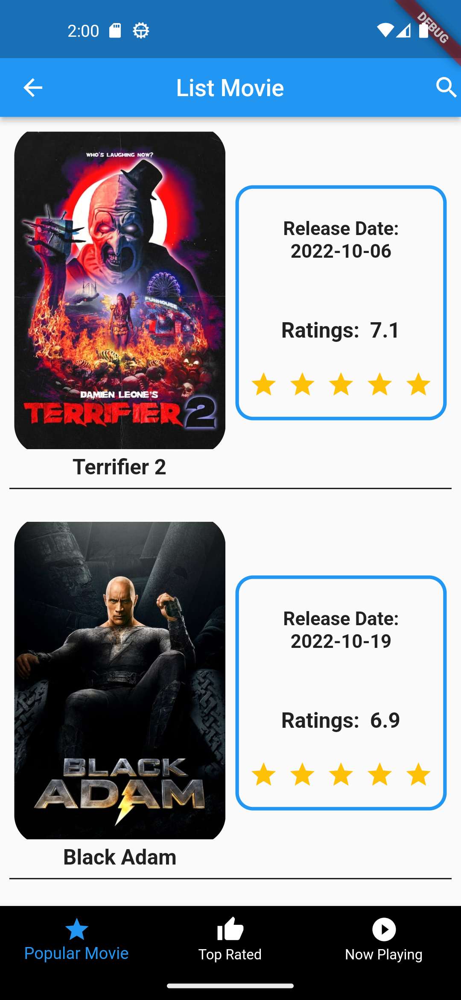

# My Flutter Course

This is my first mobile app project that I created during my study in Course-Net. This app has several variety of pages such as current location in the map, statistic of total result of Covid-19 patients, movies page, image gallery page, calendar page and listview page.
This project will be improved from time to time.

### Technologies used: 
- dart SDK version: 2.18.2
- Flutter 3.3.5
- Visual Studio Code,
- Android Studio

 

